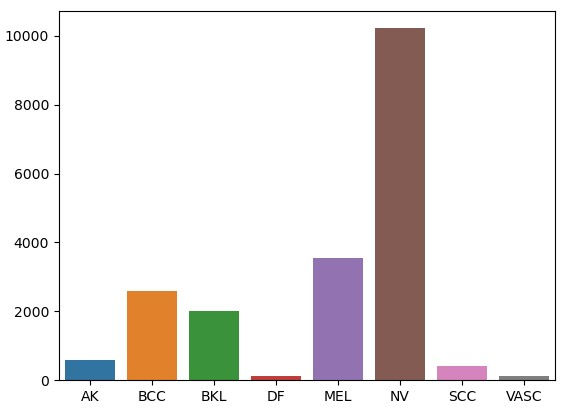
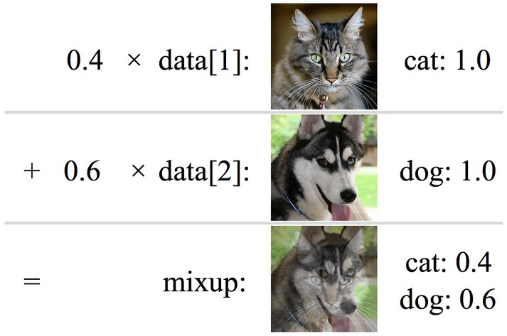
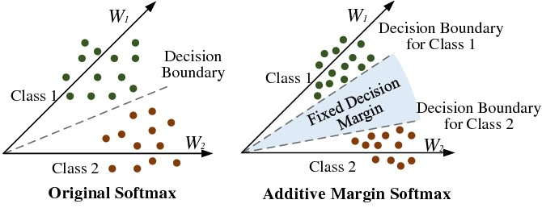
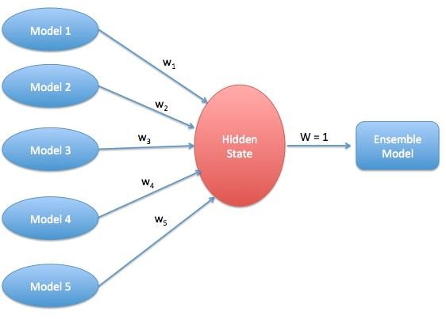
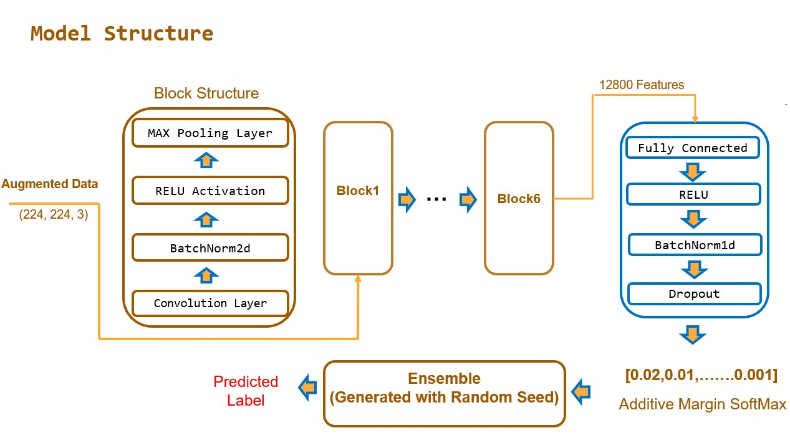
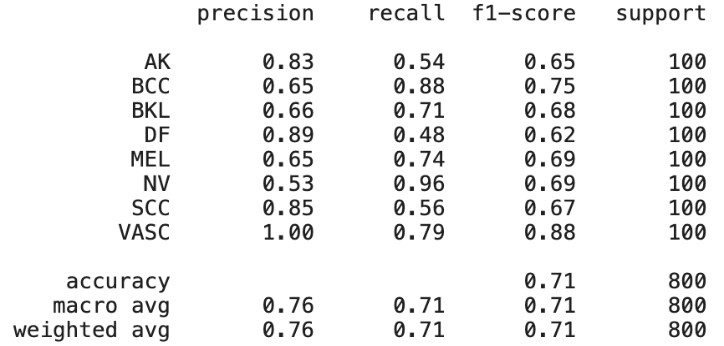

  

**City University of Hong Kong** 

 **CS4486 Artificial Intelligence** 

# Assignment 3

**Topic 5: Skin Cancer Classification With CNN** 

**LI TINGYOU 56490490** 

**LUO PEIYUAN 56642728** 

## Project Description

Implemented CNN to predict the labels of dermoscopic images among eight diagnostic categories. And applied different data augmentation techniques(Random Horizontal Flip, Random Vertical Flip, Random Affine, Random Rotate) and other boosting techniques (Mix-Up, Additive SoftMax Margin, Ensemble) to improve the classification accuracy.

## 1. Background

Prospects of the Skin Cancer Classification 

Skin cancer is a prevalent type of cancer worldwide, with around 5.4 million cases detected annually. Early detection and treatment are crucial for better patient outcomes and reduced mortality rates. Dermatologists visually inspect skin lesions for diagnosis, yet this method is time-consuming, subjective, and error prone. Computer-aided diagnosis (CAD) based on machine learning and deep learning techniques can assist dermatologists in diagnosing skin cancer by autonomously analysing skin lesion images for objective and accurate assessments of malignancy probability. 

 

## 2. Data Preprocessing

### 2.1 Dataset Description

The datasets contain 8 classes of images of skin cancer. The images are well cropped into size 88 \* 88. And they are in RGB (3). 

### 2.2 Data Exploration

The dataset consists of 8 classes where the total number of each class is unbalanced. From Fig.1, it is not hard to see that the VASC and DF has the least of number of training data while NV has the most training data. 

Also, for each image, the file is in jpg format and all sized in 88x88. We resized the image inputs into 224 \* 224 for later training. 

  

Distribution of Different Classes of Training Data 

### 2.3 Data Selection

1. Keeping all Data

For each class, the training data is separated into training and validation set according to 4:1. 

1. Undersampling

Since the data is in unbalanced state, the raw data could lead to bias in the model training. Therefore, to make the model less unbiased, we keep the ratio between training and test data for each class to be 4:1. For classes with training data fewer than 400 (100\*4) records, we keep all the records. 

Ensemble with Majority Vote

However, such selection may lead to less learning in those classes with more training data. Therefore, such selection is conducted randomly 10 times to generate 10 different models. And the final prediction will be based on the majority vote of these ten models. 

 

## 3. Data Augmentation

Since the cancers are taken picture in different angles, we take the following measures before training. 

* Random Horizontal Flip
* Random Vertical Flip
* Random Affine
* Random Rotate

Additionally, we used Mix-Up for image augmentation. It will be introduced in the later sections. 

 

## 4. Boosting Techniques

### 4.1 Mix-Up

It works by works by taking two examples from the training data, x\_i and x\_j, and two corresponding labels, y\_i and y\_j. It then creates a new synthetic example, x\_{mix}, by taking a linear combination of the two examples. According to the study by Zhang et al. (2018), it can steadily increase at least 1.2% of accuracy without additional computation. 

In our implementation, we used alpha=0.3 as the mix-up extent. It is also referred in the paper as the best hyperparameter for most image sets. 

  

### 4.2 Additive SoftMax Margin

Similar to SVM, the additive SoftMax Margin (Chang, X., Dai, H., & Jordan, M. I., 2018) adds a margin term to the SoftMax loss function. The margin term encourages the model to learn decision boundaries that are well-separated between the classes, by penalizing the model for making predictions with low confidence. It could be illustrated through below figure. 

  

### 4.3 Ensemble

Different Models are generated. And the final result is predicted based on the major vote of these 5 models. This could further reduce the systematic error in the prediction. 

  

## 5. CNN Model Structure

Our convolution neural network is built by hand and consists of 6 blocks where each block is contains convolution and batch normalization, RELU and Max Pooling Layers. After the convolution part, the extracted features are further fed into a fully connected layer for further predictions. Finally, the logits are generated together to predict the final result. 

  

## 6. Experiment and Performance

### 6.1 Metrics Chosen

Since the test data is in uniform distribution, accuracy will be enough to exam the performance. **6.2 Some Testing Experiments before Training** 

Since the data is quite unbalanced, before we do the classification. We changed the problem into a binomial classification. 

To be more detailed, for the rare classes with fewer than 1000 records, they are extracted out. Meanwhile, we randomly select the same number of records from other classes to make a training dataset. There are two labels, the rare class, and “others”. The test set will only be the rare class test set in the original data (n=100). This experiment aims to see how well CNN can performs on the rare classes when the difficulty and bias of model is minimized. 

Surprisingly, for class DF, VASC, they all showed around 34% and 81% while AK and SCC showed around 68% and 56%. 

It indicates that when training with all the classes, the model is likely to perform worse than this. Therefore, there is a tradeoff between the overall accuracy and sub class accuracy. Undersampling means lowering the accuracy of major classes while improving rare class accuracy. However, whether the improvement part is more than lowering part still needs later experiments. 

 
In the later experiments, we used undersampling for two reasons. First, past research shows that oversampling rarely performs. Second, oversampling could lead to large dataset. The time for training models could be quite consumed. 

**6.3 Experiment Results** 

## Training with Undersampled Dataset (<3000 Records)

|  |  |  |
| --- | --- | --- |
| Model  | Accuracy  | Running Time (Approximate)  |
| 3-Block CNN  | 0.45  | 20 minutes  |
| 5-Block CNN  | 0.50  | 40 minutes  |
| 5-Block CNN + CNN + Mix-Up + Additive SoftMax  | 0.48  | 50 minutes  |
| Above + Ensemble  | 0.54  | 120 minutes (3x RTX3090)  |

**The Best Prediction**

 

  

  

 

## Training with Full Dataset (Around 24499 Records)

|  |  |  |
| --- | --- | --- |
| Model  | Accuracy  | Running Time (Approximate)  |
| 3-Block CNN  | 0.52  | 140 minutes  |
| 5-Block CNN  | 0.625  | 185 minutes  |
| 5-Block CNN + CNN + Mix-Up + Additive SoftMax  | 0.67  | 210 minutes  |
| Above + Ensemble  | 0.701  | 420 minutes (3 models each Time)  |

 

### 6.4 Findings and Discussion

We found that the model trained with full dataset has better performance than the one trained with undersampling. The best model indicates similar results with the ones we had on binomial classification experiments. The classes with more training data had overall higher accuracy. It is noticeable that though VASC has only around 100 records, it had 79% accuracy. Also, it has 100% recall. It means that such a class may have distinct features with other classes. 

For this dataset, when using undersampling, the improvement of rare class accuracy is less than the loss of the accuracy in majority class. Therefore, including all data from the major classes could instead increase the overall accuracy of the model. 

 

## 7. Contribution of Team Members

Both teammates put 100% effort into code writing and experiment design as well as report writing. 

 

 

 

 

 

